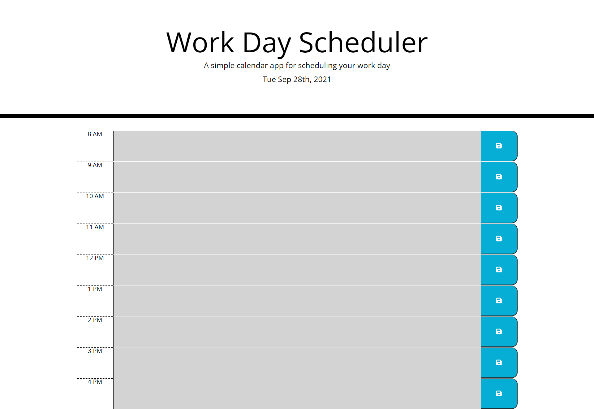

# Work-Day-Scheduler

Work Day Scheduler

# Created by:

Jackson Barker

# Work Day Scheduler

This work dar scheduler will present the user with rows for each hour of the work day. The user can enter a task for a specific hour. The color of the text box will indicate if that hour of the day is in the past, present or future.

# Usage

- The user will be presented with rows for every hour in a work day.
- When the user enters a task in the description and clicks the save icon, the task will be saved to local storage.
- If the the hour of the task is in the past it will be displayed in red, if it is in the current hour it will be displayed in grey and if it is in the future it will be displayed in green.

# Credits

# Link

https://jackson-barker.github.io/Work-Day-Scheduler/

# Screen Shot

